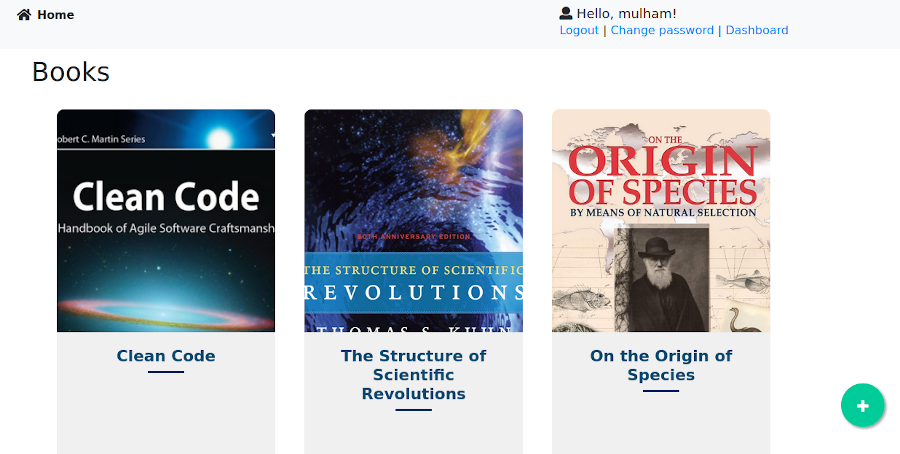

# Django-Project
A Simple Library Web Application using Django

## Screenshot

## Features

* Books app with categories, Description and comment form

* Users app where just the registered users can view the download links and editors can add new books.

* A simple usage of RESTful API and Ajax 

## Requirements

* asgiref==3.3.4

* certifi==2021.5.30

* chardet==4.0.0

* Django==3.2.3

* idna==2.10

* Pillow==8.2.0

* pytz==2021.1

* requests==2.25.1

* sqlparse==0.4.1

* urllib3==1.26.5

## License

MIT - [Read License File](https://github.com/Mulham/Django-Project/blob/main/LICENSE)
